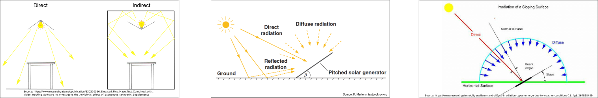

# dwd2pv
Use open data forecast from Deutscher Wetterdienst to estimate photovoltaics power over time.

## Language and geographical scope

Long time I was not sure if I should write the documentation in English or German, so you may find parts of both in the comments. While [photovoltaic] physics is the same all over the world, I assumed the data [source] to be Germany-focused. In fact, the source states that MOSMIX data is provided *"for about 5400 locations around the world. Most forecasting locations are spread over Germany and Europe"* [1]. More precise: 74% of all locations are in Germany (if you only count locations for which irradiation data is offered; else: 50%). 
You can illustrate that with a station map, e.g. by uploading to umap.openstreetmap.fr [2]. This screenshot of the map only shows European stations for which irradiation forecasts (Rad1h) are available:


Raw numbers (not verified; subsidary output of 'stationlist2csv.py'):

<code>
#rows with any coordinates:         5966<br/>
#rows with valid continent:         5712<br/>
#rows with continent Europe:        4440<br/>
#rows with country Germany:         2989<br/>
#rows that offer Rad1h in Germany:  2264<br/>
#rows that offer Rad1h worldwide:   3061<br/>
</code><br/>

Even if the data [source] might be most accurate for Germany, it is not limited to that. So I will keep the documentation in English.

Btw: You can use the map [2] to find relevant stations in your region. Make sure to only display the *filtered*-layer, to exclude stations without irradiation data.


## Simplicity  

I am using very simple models for all of the calculations. For various reasons. 
 1. I prefer simple solutions.
 2. I like models I can understand. 
 3. A chain is only as strong as its weakest link (the weather forecast?)

 ## Not new

The idea is not new. I think I first read about it here [3], which lead to [4]. Similar to that, this is not a full-blown solution, but rather a few documented ideas that might help you avoid some pitfalls when trying to build something similar. 

A special focus of this project is on the temporal interpolation of irradiation data. My goal was to generate a pv forecast for the next 1 or 2 days. Not only the total energy production, but power over time. In the *hope* that this might help me increase my direct consumption.

## System partitioning
The processing is split into multiple steps. Results (also intermediate ones) are stored as CSV. 


It is helpful to have real inverter data for model tuning and knowing you are on the right way. (not part of the project)


### dwd2csv.py

Weather forecast is the most critical input to our process chain, and weather forecasts work best for the near future. So the first task is get the *current* forecast from the DWD server, extract the relevant data (and forget the rest: MOSMIX offers up to "115 parameters, up to +240h", for "about 5400 locations" [1]). And write it to file for further processing.

Possible improvements/alternatives:
- There might be APIs that could also do the parsing job, probably wetterdienst [5] or brightsky [6] are worth a try.
- There might be better data sources, probably ICON-D2 [7] is worth a try. I didn't try yet.
- The act of choosing the right station(s) could be automated. 

### csv2csv.py

The most relevant parameter for our goal - Rad1h - is not offered for every station. "Grundsätzlich gilt, dass MOSMIX konservativ vorgeht und statt einer schlechten Vorhersage tendenziell Fehlwerte ausgibt." [8] So the first step is local interpolation. In my case - I live in the middle between 2 stations that do offer Rad1h - I just take the mean value of 2 stations. 

`Rad1h` stands for `Global Irradiance` in `kJ/m2` [9]. I seems to be the sum over the last hour (`1h`) before the timestamp (which are in UTC btw). Or said otherwise: the *mean* value of power [per 1 *flat* m²] for 1 hour. I asked DWD for a confirmation but no response so far. Plotting this results in stair steps, because 1 hour is a poor resolution if you want to plot the temporal behaviour for 1 day. 

Let's do some temporal interpolation, in a way that
- there are no steps (continous shape), but
- the mean value over 1 hour remains the same (equal integral).
The rest is just math (assume straight lines, define constraints, and solve the linear equation system...). 

Looks much more realistic. 


Other data is availabe for a nearer station, so I can use that directly. And most other data seems to be given as instantaneous value for the given timestamp - so can simply be interpolated linearly for a finer time grid. 

`Neff` stands for `Effective cloud cover` in `% (0..100)`. We will use that later. 

### csv2pv.py

Now that we have weather variables available at the desired time grid, we need to translate it to pv power. We do that for each time step individually. 

First (and probably the biggest) problem: Our irradiation data is only given for a flat area, which is a very uncommon orientation for pv modules. The conversion is further complicated because the irradiation data is only given as a total sum of all components (repectively their mapping on the flat plane). For translation we first need to divide the irradiation into at least 2 components: direct and indirect light. 

A picture is worth a thousand words, so here are 3000 words in pictures, a selection what you can find when searching the web, that is worth thinking about:

 
Sources: left [I1], middle [I2], right [I3]

My splitting approach is using the cloud cover `Neff`. The more cloud cover, the more indirect light. Linear interpolation between the following extremes:
- No clouds -> only direct light -> no indirect light
- 100% clouds -> only indirect light -> no direct light

While we can use the indirect component as-is in first approximation, the directed light component requires transformation. We need to consider the pv orientation with respect to the ground and sun, e.g. by the following two steps:
1. power estimation in sun direction (instead of projection to the ground)
2.  power estimation in pv orientation (by its tilt against the sun (not ground)).

 

$\alpha$ is the sun's elevation, which can be determined by location and time. $\beta$ is a little more tricky, as it is an angle between two 3D vectors: the sunlight (represented e.g. as azimut+elevation) and the plant (represented as the pv plane's normal vector, derived from orientation+tilt). The rest is trigonometry. 

Now that we know the effective irradiation power for our pv plane, we can model the pv plant itself. The most simple model is a constant correction factor, which we can derive from the energy conversion efficiency of the modules and inverter and the area of all modules. The overall conversion efficiency is typically less than 20% and thus not negligable.

Assuming the conversion efficiency to be constant is only an approximation. In reality it depends, for the panels as well as for the inverter. The panel temperature is known to have strong impact, and it is not easy to determine, as the temperature itself depends on a lot of factors (e.g. wind/venting, rain/cooling, irradiation/heating, history...). A very simple estimate for low light condition is: the ambient temperature. For significant irradiation I chose the Stefan–Boltzmann law. The list of factors is endless. And other circumstances will ruin the proposed prediction completely, e.g. snow. Here are the results for 3 summer days in 2022:


The result is *ok*, but leaves room for improvement.

Possible improvements on the latest step:
- More sophisticated decomposition of the planar radiation value
    - Even better: Find a source that offers the components to supersede the entire decomposition
- Use better models for the energy conversion, especially for the panels,
    - e.g. better model for the panel temperature
- simply use librarys that are made for this puspose; like pvlib [F1]

But note that the best model will *not* satisfy you, if the input data is lousy. My opinion after this little experiment: The MOSMIX prediction is good enough to distinguish sunny from cloudy days, and the overall daily production estimate is *ok*. But the temporal behaviour does not fit well. 8/25 was *sunnier* than predicted, while the *very cloudy* afternoon of 8/26 is not visible in the prediction at all.


## Further reading

Some recommendations for futher reading.
- ```pvlib```'s documentation [F1]. To get an impression of what else is possible. 
- ```pvsol```'s documentation [F2]. To my surprise, the vendor of this commercial software discloses a lot of interesting background.
- ```folsomlabs```'s documentation [F3]. Also a commercial vendor. I found that page when looking for illustrative pictures. Looks like a good introduction to the topic to start with.


## Sources

[1] https://www.dwd.de/EN/ourservices/met_application_mosmix/met_application_mosmix.html <BR/>
[2] https://umap.openstreetmap.fr/de/map/dwd-mosmix-stations_802117 <BR/>

[3] https://www.photovoltaikforum.com/thread/144350-kostenlose-wetterprognose-pv-prognose-ertragsprogonse-mit-st%C3%BCndlicher-aufl%C3%B6sung/<BR/>
[4] https://github.com/kilianknoll/DWDForecast <BR/>
[5] https://wetterdienst.readthedocs.io/en/latest/ <BR/>
[6] https://github.com/jdemaeyer/brightsky <BR/>
[7] https://dwd-geoportal.de/products/G_E6D/ <BR/>
[8] https://www.dwd.de/DE/leistungen/met_verfahren_mosmix/faq/faq_mosmix_node.html <BR/>
[9] mosmix_elemente.xls from https://www.dwd.de/DE/leistungen/opendata/hilfe.html

[I1] https://www.researchgate.net/publication/330220556_Elevated_Plus_Maze_Test_Combined_with_Video_Tracking_Software_to_Investigate_the_Anxiolytic_Effect_of_Exogenous_Ketogenic_Supplements <BR/>
[I2] K. Mertens: textbook-pv.org https://textbook-photovoltaics.org/figures.html <BR/>
[I3] https://www.researchgate.net/figure/Beam-and-diffuse-irradiation-types-emerge-due-to-weather-conditions-11_fig1_264858489 <BR/>

[F1] https://pvlib-python.readthedocs.io/en/stable/reference/irradiance.html <BR/>
[F2] https://help.valentin-software.com/pvsol/en/calculation/ <BR/>
[F3] https://www.folsomlabs.com/modeling <BR/>
